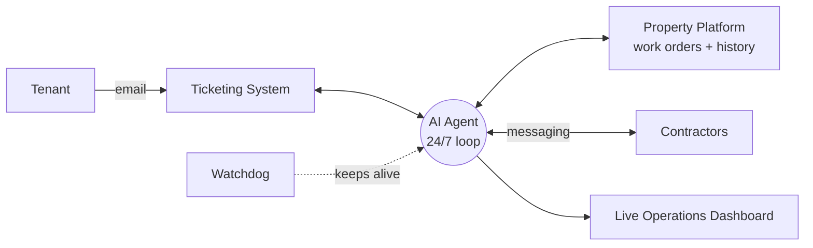

# 🛠️ Autonomous Property-Maintenance Operations Agent

[](https://github.com/Abz786521/maintenance-agent-showcase/actions/workflows/ci.yml)


[](LICENSE.txt)

**A 24/7 AI agent that runs a property-maintenance back office end-to-end — reading tenant requests, raising and tracking jobs, coordinating contractors, and keeping every record in sync across three separate systems.**

> © 2026 **Abdul Talib** — All Rights Reserved. This repository is a **showcase only**.
> The source code, workflows and integrations are **proprietary and private** and are **not** published here.
> See `LICENSE.txt`.

---

## The problem

A busy property-maintenance team handles a constant stream of tenant issues — damp, mould, leaks, pests, repairs — spread across **three disconnected systems**:

- a **ticketing system** for tenant communication,
- a **property-management platform** where work orders and property history live,
- and **messaging** for talking to contractors.

Keeping these in sync by hand is slow and error-prone: tickets sit un-acknowledged, titles are inconsistent, jobs get logged twice, and compliance deadlines (e.g. damp/mould response windows) get missed. The work is high-volume and repetitive — exactly what an agent should own.

## What the agent does

It treats the three systems as **one pipeline** and automates the full lifecycle of a maintenance ticket:

| Stage | What the agent does | Status |
|---|---|---|
| **Acknowledge** | Replies to every new tenant ticket within minutes with a tailored receipt email | ✅ Autonomous |
| **Normalise** | Rewrites the ticket title to a strict `[full address] // issue` format using the property database | ✅ Autonomous |
| **Fix the contact** | When a ticket arrives via a forwarding/website mailbox, finds the real tenant's email in the body and corrects the requester | ✅ Autonomous |
| **Triage & diagnose** | Classifies the issue (e.g. condensation vs penetrating vs rising damp vs leak) and routes it to the right trade (roofer / plumber / damp / mould specialist) | ✅ Autonomous |
| **Observation note** | Posts an internal note: what's been done, what's needed next, and the recommended contractor | ✅ Autonomous |
| **Pest workflow** | Sends standard council advice for routine pest cases automatically | ✅ Autonomous |
| **Raise the work order** | Creates the job in the property system and allocates the correct regional contractor — **with a duplicate-guard so it never raises the same job twice** | 🔜 In design |
| **Coordinate contractors** | Messages the right contractor to book the visit and chase before/after photos | 🔜 In design |
| **Sign-off** | Scans completed jobs, verifies contractor evidence (photos), and signs them off in the tracking spreadsheets | ✅ Autonomous |

Everything runs **unattended, around the clock**, deduplicated and fully audited, with a watchdog that restarts any component that fails.

## How it works



- **Ticketing system** = the tenant side (the request, the conversation, acknowledgement).
- **Messaging** = the contractor side (booking the job, chasing photos).
- **Property platform** = the source of truth where they meet — the property record and the **work order** that proves a ticket is actually being actioned.

A ticket isn't "handled" just because there's a note — it's handled when there's a **live work order with a contractor**. The agent enforces that link.

### The autonomous loop
A supervising **watchdog** triggers a cycle on a fixed interval. Each cycle pulls new tickets and runs the automated stages above, writes a full audit trail, and self-heals (restarts any crashed service). A **live operations dashboard** shows what the agent is doing now, what's next (with countdowns), and surfaces compliance risks — e.g. damp/mould jobs approaching their statutory response window — so a human supervises *by exception* rather than touching every ticket.

### The "Property Brain" (in design)
Before the agent raises any job autonomously, it consults a per-property knowledge layer built from the property platform's work-order history, closed-ticket resolutions, spend history, and contractor messaging patterns — so it **never creates a duplicate**, and it books the contractor the way an experienced admin would.

### A learning loop
Every action is audited. When a human overrides the agent (changes a title back, re-assigns a contractor, re-opens a ticket), the system records the correction as a rule and applies it to every future ticket — so its error rate trends down over time. Auto-learned rules stay "advisory" until confirmed, so it can't teach itself a bad habit unchecked.

## Engineering highlights

- **Three-system orchestration** with no official API for some actions — solved with secure local browser bridges where needed.
- **Resilience-first**: single supervising watchdog, automatic restart of failed components, cache-first boot so the UI never hangs, graceful deferral when a resource is locked.
- **Safety rails throughout**: supervised-mode guards, per-run send caps, a confidence gate + human-only stops for legal/complaint/vulnerable cases, kill-switches, and a complete audit log of every action.
- **Performance**: precomputed/cached endpoints so a single-process server stays responsive under continuous load.

## 🎯 What this demonstrates

This project showcases the ability to:

- **Ship an autonomous agent that owns a real, high-volume business workflow end-to-end** — not a toy or a demo-only prototype, but a system running in production 24/7.
- **Integrate and orchestrate multiple third-party platforms** (ticketing, property management, time-tracking, messaging) into one coherent pipeline — including building secure local **browser bridges** where no public API exists.
- **Engineer for unattended 24/7 reliability** — a self-healing watchdog, graceful degradation, deduplication, caching for responsiveness, and a complete audit trail of every action.
- **Build *safe* automation** — supervised-mode guards, per-run send caps, a confidence gate with human-only escalation for legal/complaint/vulnerable cases, kill-switches, and a learning loop that turns human corrections into rules.
- **Encode real domain knowledge** — e.g. statutory damp/mould response windows and trade-routing logic — directly into automated decision-making.
- **Deliver full-stack** — backend automation, a live operations dashboard (HTML/JS), data modelling, and the operational tooling to keep it all running — designed, built, and operated solo.

> 🎬 **Try it live:** open [`demo/demo.html`](demo/demo.html) in any browser — a self-contained demo of the operations dashboard running on **synthetic sample data** (no server, no install, no real data). See [`SETUP.md`](SETUP.md).
>
> [`docs/index.html`](docs/index.html) contains the same dashboard as a GitHub Pages-ready entry point.

### Runnable clean-room logic demo

This repository also includes a small PowerShell module that demonstrates the agent's decision pipeline on synthetic tickets only. It classifies tenant wording, scores SLA windows, maps regions, routes trades, prevents duplicate work orders, and emits the next action without touching any external system.

```powershell
powershell -NoProfile -ExecutionPolicy Bypass -File .\demo\agent\Run-Demo.ps1
```

The logic is covered by Pester tests and GitHub Actions CI on Windows and Ubuntu:

```powershell
Import-Module Pester -MinimumVersion 5.0 -Force
Invoke-Pester -Path .\tests -Output Detailed
```

For a concise proof map, see [`docs/EVIDENCE.md`](docs/EVIDENCE.md).

### Proof commands

| Command | Proves |
|---|---|
| `powershell -NoProfile -ExecutionPolicy Bypass -File .\demo\agent\Run-Demo.ps1` | End-to-end synthetic decision run: classification, SLA scoring, routing, human hold, pest advice, duplicate guard. |
| `Invoke-Pester -Path .\tests -Output Detailed` | Unit and integration coverage for the clean-room logic module. |
| GitHub Actions `CI` | Same tests on Windows and Ubuntu, plus a smoke run of the demo script. |

## Architecture at a glance

```
            ┌──────────────┐         ┌─────────────────────┐
 Tenant ───▶│  Ticketing   │◀───────▶│                     │◀──── messaging ────▶ Contractors
            └──────────────┘         │     AI AGENT        │
            ┌──────────────┐         │  (24/7 work loop)   │
            │  Property    │◀───────▶│                     │
            │  Platform    │         └──────────┬──────────┘
            └──────────────┘                    │
                  ▲                              ▼
                  │                    ┌─────────────────────┐
              Watchdog ────keeps──────▶│  Live Dashboard +   │
              (self-heal)              │  Audit + Learning   │
                                       └─────────────────────┘
```

Each cycle: **pull new tickets → acknowledge → normalise title → fix contact → triage & route → post note → (raise WO) → sign off completed jobs**, all audited and deduplicated, with a human supervising *by exception* via the dashboard.

## Tech stack

PowerShell automation services · HTML/JS live dashboard · Node.js browser bridges · scheduled/watchdog supervision · integrations with industry-standard ticketing, property-management, time-tracking and messaging platforms.

---

## ⚠️ Note on this repository

This is a **capability showcase**, not a product. The real system — its source code, workflows, prompts, data models and integrations — is **private and proprietary**, owned by **Abdul Talib**, and is **not** included here. All names, screenshots and examples use **synthetic demo data**; no real company, tenant, contractor or personal information is contained in this repository.

**You may view this showcase. You may not copy, reuse, or build from it.** All Rights Reserved.
